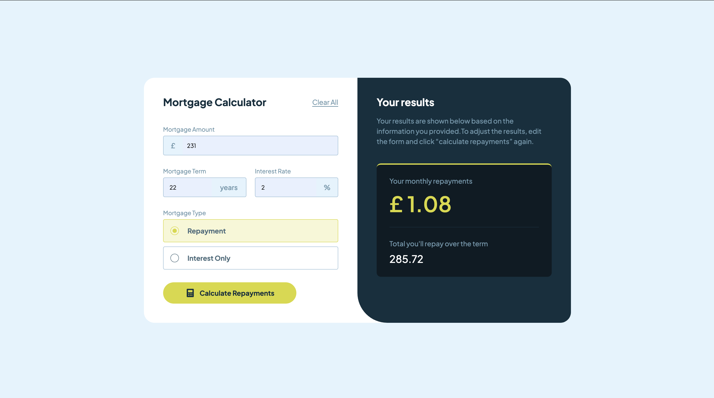

# Frontend Mentor - Mortgage repayment calculator solution

This is a solution to the [Mortgage repayment calculator challenge on Frontend Mentor](https://www.frontendmentor.io/challenges/mortgage-repayment-calculator-Galx1LXK73). Frontend Mentor challenges help you improve your coding skills by building realistic projects.

## Table of contents

- [Overview](#overview)
    - [The challenge](#the-challenge)
    - [Screenshot](#screenshot)
    - [Links](#links)
- [My process](#my-process)
    - [Built with](#built-with)
    - [What I learned](#what-i-learned)
    - [Continued development](#continued-development)
    - [Useful resources](#useful-resources)
- [Author](#author)

## Overview

### The challenge

Users should be able to:

- Input mortgage information and see monthly repayment and total repayment amounts after submitting the form
- See form validation messages if any field is incomplete
- Complete the form only using their keyboard
- View the optimal layout for the interface depending on their device's screen size
- See hover and focus states for all interactive elements on the page

### Screenshot

### Links

- Solution URL: https://github.com/amjadsh97/mortgage-repayment-calculator-app
- Live Site URL: https://mortgage-repayment-calculator-app.vercel.app/

## My process

### Built with

- Semantic HTML5 markup
- CSS custom properties
- Flexbox
- [React](https://reactjs.org/) - JS library
- [Formik](https://formik.org/) - Build forms in React

### What I learned
I learned how to handle form by using formik library. it was great and helpful.

### Continued development
I will make an app by using formik and integrate it with backend.

### Useful resources
- [React Docs](https://react.dev/) - This helped me for building react components. I really liked using this docs.

## Author

- Website - [Amjad Shadid](https://amjadshadid.com)
- Frontend Mentor - [@amjadsh97](https://www.frontendmentor.io/profile/amjadsh97)
- Twitter - [@Amjadshadid](https://twitter.com/Amjadshadid)
- Linkedin - [@Amjad Shadid](https://www.linkedin.com/in/amjad-shadid-134355134/)